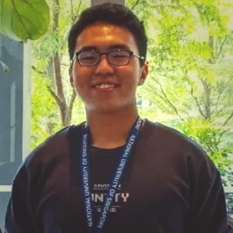

We are a team based in the [School of Computing, National University of Singapore](https://www.comp.nus.edu.sg).

## Project team

Our tutor is **Priyadarshi Charvi**. Our team consists of 5 members.

### Lee Yi Heng

_A Year 2 Mathematics and Computer Science student at NUS with an interest in backend engineering and machine learning._

[[homepage](https://www.linkedin.com/in/lee-yi-heng-nus/)]
[[github](https://github.com/henghengyh)]
[[portfolio](team/yiheng.md)]

* Role: Team Lead
* Responsibilities: 
    * Backend Integration
    * UI Design
    * Code Review

### Choy Min Han

[[homepage](https://www.linkedin.com/in/choy-min-han/)]
[[github](http://github.com/Choy050823)]
[[portfolio](team/choyminhan.md)]

* Role: Software Developer
* Responsibilities: UI

### Johnny Doe

[[github](http://github.com/johndoe)] [[portfolio](team/johndoe.md)]

* Role: Developer
* Responsibilities:
  * Backend Integration
  * UI Design
  * Code Review

### Nguyen Viet Quang

[[github](http://github.com/vietquang1006)]

* Role: Developer
* Responsibilities: Backend

### Nguyen An Thinh

[[github](http://github.com/natsupercell)]

* Role: Developer
* Responsibilities: UI

### Chai Yi Kang

[[homepage](https://chaiyikang.vercel.app)]
[[github](http://github.com/chaiyikang)]

- Role: Developer
- Responsibilities: Be cool
