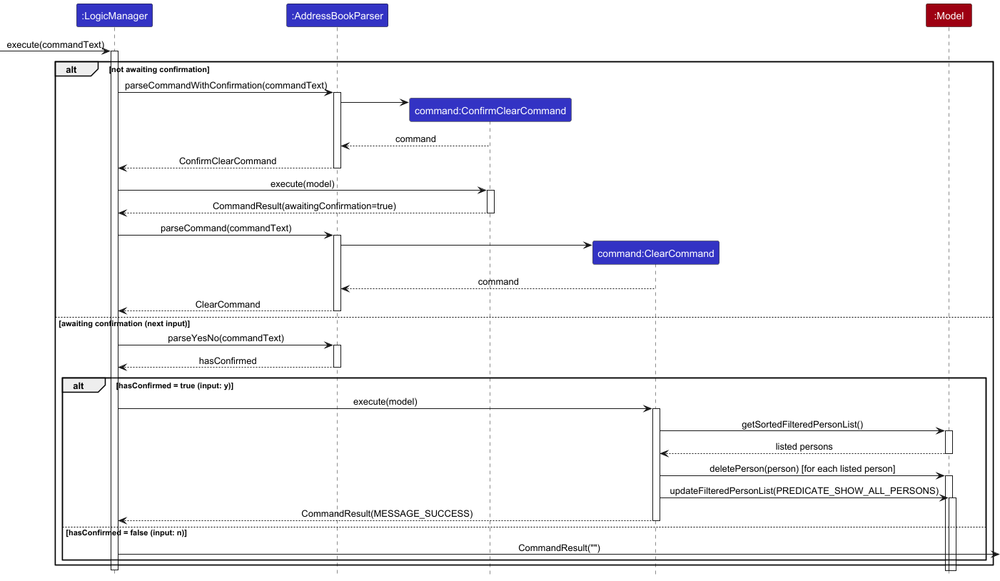
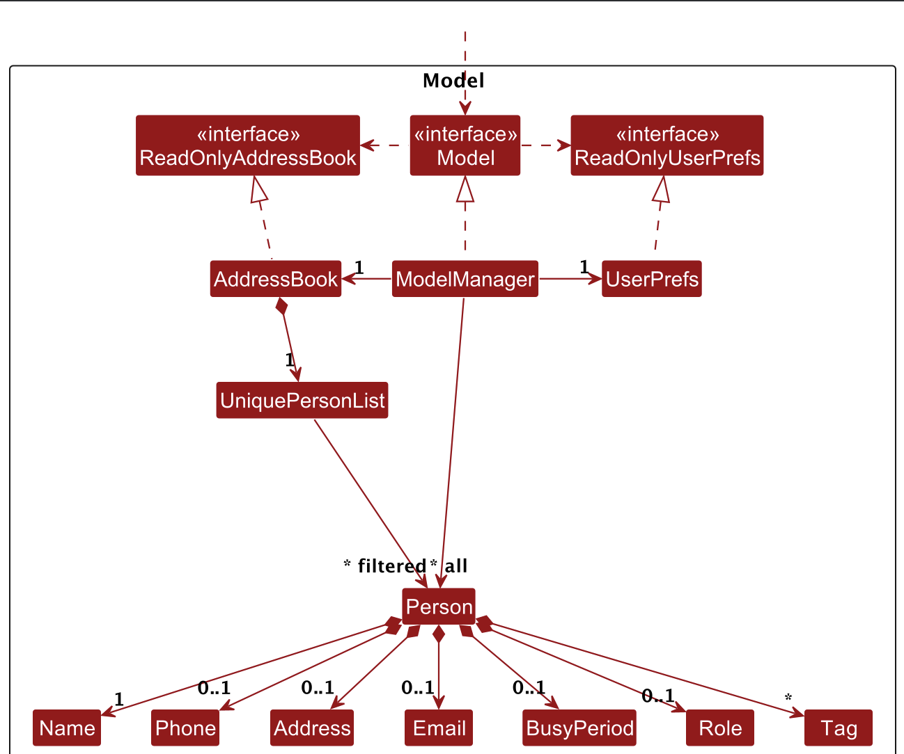
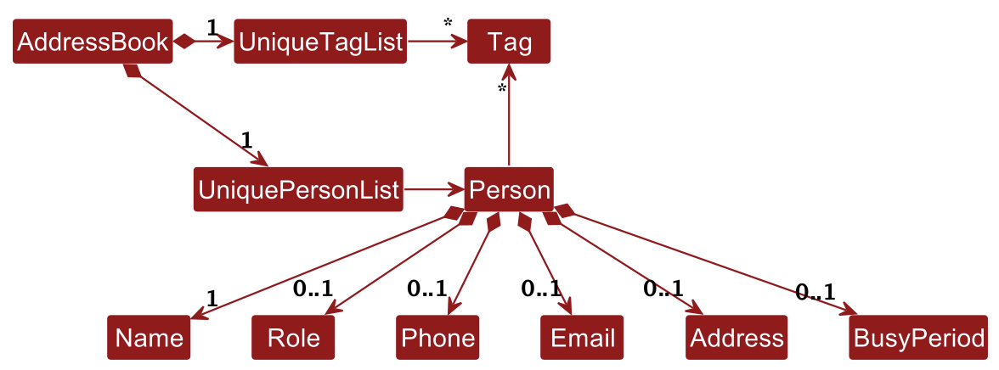

<!--
Thinh: I used AI assistance to help identify relevant sections of the User Guide
to update and to refine parts of the documentation wording and examples for the
features described here. I reviewed and adapted the final documentation.
-->

## **Table of Contents**

- [Acknowledgements](#acknowledgements)
- [Setting up, getting started](#setting-up-getting-started)
- [Design](#design)
    - [Architecture](#architecture)
    - [UI component](#ui-component)
    - [Logic component](#logic-component)
    - [Model component](#model-component)
    - [Storage component](#storage-component)
    - [Common classes](#common-classes)
- [Implementation](#implementation)
    - [Confirmation flow for `add`, `edit`, `delete`, and `clear`](#confirmation-flow-for-add-delete-and-clear)
    - [Busy status feature](#busy-status-feature)
    - [Phone number normalization](#phone-number-normalization)
    - [[Proposed] Undo/redo feature](#proposed-undoredo-feature)
    - [[Proposed] Data archiving](#proposed-data-archiving)
- [Documentation, logging, testing, configuration, dev-ops](#documentation-logging-testing-configuration-dev-ops)
- [Appendix: Requirements](#appendix-requirements)
    - [Product scope](#product-scope)
    - [User Stories](#user-stories)
    - [Use cases](#use-cases)
    - [Non-Functional Requirements](#non-functional-requirements)
    - [Glossary](#glossary)
- [Appendix: Instructions for manual testing](#appendix-instructions-for-manual-testing)
    - [Launch and shutdown](#launch-and-shutdown)
    - [Adding a person](#adding-a-person)
    - [Editing a person](#editing-a-person)
    - [Deleting a person](#deleting-a-person)
    - [Finding persons](#finding-persons)
    - [Listing persons](#listing-persons)
    - [Saving data](#saving-data)

--------------------------------------------------------------------------------------------------------------------

## **Acknowledgements**

* {list here sources of all reused/adapted ideas, code, documentation, and third-party libraries -- include links to the original source as well}

--------------------------------------------------------------------------------------------------------------------

## **Setting up, getting started**

Refer to the guide [_Setting up and getting started_](SettingUp.md).

--------------------------------------------------------------------------------------------------------------------

## **Design**

<div markdown="span" class="alert alert-primary">

:bulb: **Tip:** The `.puml` files used to create diagrams are in this document `docs/diagrams` folder. Refer to the [_PlantUML Tutorial_ at se-edu/guides](https://se-education.org/guides/tutorials/plantUml.html) to learn how to create and edit diagrams.
</div>

### Architecture


The ***Architecture Diagram*** given above explains the high-level design of the App.

Given below is a quick overview of main components and how they interact with each other.

**Main components of the architecture**

**`Main`** (consisting of classes [`Main`](https://github.com/se-edu/addressbook-level3/tree/master/src/main/java/seedu/address/Main.java) and [`MainApp`](https://github.com/se-edu/addressbook-level3/tree/master/src/main/java/seedu/address/MainApp.java)) is in charge of the app launch and shut down.
* At app launch, it initializes the other components in the correct sequence, and connects them up with each other.
* At shut down, it shuts down the other components and invokes cleanup methods where necessary.

The bulk of the app's work is done by the following four components:

* [**`UI`**](#ui-component): The UI of the App.
* [**`Logic`**](#logic-component): The command executor.
* [**`Model`**](#model-component): Holds the data of the App in memory.
* [**`Storage`**](#storage-component): Reads data from, and writes data to, the hard disk.

[**`Commons`**](#common-classes) represents a collection of classes used by multiple other components.

**How the architecture components interact with each other**

The *Sequence Diagram* below shows how the components interact with each other for the scenario where the user issues the command `clear` and subsequently confirms the deletion..



Each of the main components (also shown in the diagram above),

* defines its *API* in an `interface` with the same name as the Component.
* implements its functionality using a concrete `{Component Name}Manager` class (which follows the corresponding API `interface` mentioned in the previous point.

For example, the `Logic` component defines its API in the `Logic.java` interface and implements its functionality using the `LogicManager.java` class which follows the `Logic` interface. Other components interact with a given component through its interface rather than the concrete class (reason: to prevent outside component's being coupled to the implementation of a component), as illustrated in the (partial) class diagram below.


The sections below give more details of each component.

### UI component

The **API** of this component is specified in [`Ui.java`](https://github.com/se-edu/addressbook-level3/tree/master/src/main/java/seedu/address/ui/Ui.java)


The UI consists of a `MainWindow` that is made up of parts e.g.`CommandBox`, `ResultDisplay`, `PersonListPanel`, `StatusBarFooter` etc. All these, including the `MainWindow`, inherit from the abstract `UiPart` class which captures the commonalities between classes that represent parts of the visible GUI.

The `UI` component uses the JavaFx UI framework. The layout of these UI parts are defined in matching `.fxml` files that are in the `src/main/resources/view` folder. For example, the layout of the [`MainWindow`](https://github.com/se-edu/addressbook-level3/tree/master/src/main/java/seedu/address/ui/MainWindow.java) is specified in [`MainWindow.fxml`](https://github.com/se-edu/addressbook-level3/tree/master/src/main/resources/view/MainWindow.fxml)

The `UI` component,

* executes user commands using the `Logic` component.
* listens for changes to `Model` data so that the UI can be updated with the modified data.
* keeps a reference to the `Logic` component, because the `UI` relies on the `Logic` to execute commands.
* depends on some classes in the `Model` component, as it displays `Person` object residing in the `Model`.

### Logic component

**API** : [`Logic.java`](https://github.com/se-edu/addressbook-level3/tree/master/src/main/java/seedu/address/logic/Logic.java)

Here's a (partial) class diagram of the `Logic` component:


The sequence diagram below illustrates the interactions within the `Logic` component, using the `execute("delete 1")` API call and its subsequent confirmation `execute("y")` as an example to demonstrate the confirmation flow.


<div markdown="span" class="alert alert-info">ℹ️ **Note:** The lifeline for `DeleteCommandParser` should end at the destroy marker (X) but due to a limitation of PlantUML, the lifeline continues till the end of diagram.
</div>

How the `Logic` component works:

1. When `Logic` is called upon to execute a command, it is passed to an `AddressBookParser` object which in turn creates a parser that matches the command (e.g., `DeleteCommandParser`) and uses it to parse the command.
1. This results in a `Command` object (more precisely, an object of one of its subclasses e.g., `DeleteCommand`) which is executed by the `LogicManager`.
1. The command can communicate with the `Model` when it is executed (e.g. to delete a person).<br>
   Note that although this is shown as a single step in the diagram above (for simplicity), in the code it can take several interactions (between the command object and the `Model`) to achieve.
1. The result of the command execution is encapsulated as a `CommandResult` object which is returned back from `Logic`.

Here is another sequence diagram illustrating the interactions within the `Logic` component, with `execute("list reverse")` API call as another example.


<div markdown="span" class="alert alert-info">:information_source: **Note:** The lifeline for `ListCommandParser` and `ListCommand` should end at the destroy marker (X) but due to a limitation of PlantUML, the lifeline continues till the end of diagram.
</div>

How the `Logic` component works (overlapping content are simplified):

* Similar to the `delete 1` command above, `AddressBookParser` creates a `ListCommandParser` which parses the argument `reverse` and returns a `ListCommand` object.
* This command object is executed by `LogicManager` which communicates with the `Model` to update the sorted & filtered list of `Person` objects in the `Model` to be in reverse order. Do note that there is no return value from the `Model` to the `Logic` for this step, as the `Model` is designed to be observed by the `UI` component, so the `UI` will automatically update itself to reflect the changes in the sorted & filtered list of `Person` objects in the `Model`.
* The command result is encapsulated as a `CommandResult` object which is returned back to `Logic`, who will return it to the higher level components (e.g. `MainWindow`, a UI component) that called it.

Here are the other classes in `Logic` (omitted from the class diagram above) that are used for parsing a user command:


How the parsing works:
* When called upon to parse a user command, the `AddressBookParser` class creates an `XYZCommandParser` (`XYZ` is a placeholder for the specific command name e.g., `AddCommandParser`) which uses the other classes shown above to parse the user command and create a `XYZCommand` object (e.g., `AddCommand`) which the `AddressBookParser` returns back as a `Command` object.
* All `XYZCommandParser` classes (e.g., `AddCommandParser`, `DeleteCommandParser`, ...) inherit from the `Parser` interface so that they can be treated similarly where possible e.g, during testing.

### Model component
**API** : [`Model.java`](https://github.com/se-edu/addressbook-level3/tree/master/src/main/java/seedu/address/model/Model.java)




The `Model` component,

* stores the address book data i.e., all `Person` objects (which are contained in a `UniquePersonList` object).
* stores the currently 'selected' `Person` objects (e.g., results of a search query) as a separate _filtered_ list which is exposed to outsiders as an unmodifiable `ObservableList<Person>` that can be 'observed' e.g. the UI can be bound to this list so that the UI automatically updates when the data in the list change.
* stores a `UserPref` object that represents the user’s preferences. This is exposed to the outside as a `ReadOnlyUserPref` objects.
* does not depend on any of the other three components (as the `Model` represents data entities of the domain, they should make sense on their own without depending on other components)

The `Phone` value object accepts phone numbers containing digits with optional spaces between digits. These spaces are removed during construction so that phone numbers are stored in a canonical format without whitespace.

<div markdown="span" class="alert alert-info">ℹ️ **Note:** An alternative (arguably, a more OOP) model is given below. It has a `Tag` list in the `AddressBook`, which `Person` references. This allows `AddressBook` to only require one `Tag` object per unique tag, instead of each `Person` needing their own `Tag` objects.<br>



</div>


### Storage component

**API** : [`Storage.java`](https://github.com/se-edu/addressbook-level3/tree/master/src/main/java/seedu/address/storage/Storage.java)


The `Storage` component,
* can save both address book data and user preference data in JSON format, and read them back into corresponding objects.
* inherits from both `AddressBookStorage` and `UserPrefStorage`, which means it can be treated as either one (if only the functionality of only one is needed).
* depends on some classes in the `Model` component (because the `Storage` component's job is to save/retrieve objects that belong to the `Model`)

### Common classes

Classes used by multiple components are in the `seedu.address.commons` package.

--------------------------------------------------------------------------------------------------------------------

## **Implementation**

This section describes some noteworthy details on how certain features are implemented.

### Confirmation flow for `add`, `edit`, `delete`, and `clear`

The application supports a shared confirmation workflow for commands that should not be executed immediately.

For `add`, confirmation is only required when the person being added already exists in the address book. Non-duplicate contacts are added immediately without any confirmation prompt.

For `clear`, confirmation is always required before clearing the currently listed/filtered contacts.

For `delete`, confirmation is always required before the actual deletion is performed.

For `edit`, confirmation is always required before the actual edit is performed. If the edit does not result in any effective change, the command is rejected instead of proceeding to confirmation.


This shared behavior is implemented using an interface `ConfirmCommand`. Concrete subclasses such as `ConfirmDeleteCommand`, `ConfirmClearCommand`, `ConfirmAddCommand`, and `ConfirmEditCommand` inherit from their base classes, while implementing `ConfirmCommand` and providing command-specific validation and confirmation messages.
#### Implementation

When the user enters a command, `LogicManager` first calls `AddressBookParser#parseCommandWithConfirmation(...)`.

If the command does not require confirmation, it is executed normally.

If the command requires confirmation, a corresponding `ConfirmCommand` subclass is executed first:
- `ConfirmAddCommand` for duplicate `add`
- `ConfirmClearCommand` for `clear`
- `ConfirmDeleteCommand` for `delete`
- `ConfirmEditCommand` for `edit`

These confirmation commands do not perform the final action immediately. Instead, they return a `CommandResult` indicating that the application is awaiting confirmation input.

For `edit`, `ConfirmEditCommand` first constructs the edited `Person` using the provided `EditPersonDescriptor`, then compares it against the original `Person` field by field. The confirmation message includes a `Changes made:` section that shows only the fields that differ, for example:

```text
Are you sure you want to edit the contact: John?
Changes made:
Name: John -> Mary
Phone number: 99999999 -> 91111111
[y/n]
```

If the edit does not make any effective change, `ConfirmEditCommand` throws a `CommandException` instead of generating a confirmation message. This prevents no-op edits from proceeding and avoids showing an empty change summary.

This makes the confirmation step more explicit by showing the exact changes before the edit is applied. The field-diff formatting logic is centralised in `ConfirmEditCommand#buildChangesMessage(...)`, allowing tests to reuse the same logic without duplicating formatting code.

`LogicManager` then enters a temporary confirmation state and stores the actual command that should be executed later if the user confirms. (The sequence diagram for this interaction is detailed in the [Logic Component](#logic-component) section above).

After that:
- if the user enters `y`, the stored command is executed.
- if the user enters `n`, the operation is cancelled. A message reflecting that the corresponding command was cancelled is shown.
- if the user enters any other input, the application reports an invalid confirmation input.

For duplicate `add`, the stored command is a confirmed `AddCommand`, which force-adds the duplicate contact after the user explicitly confirms. This keeps the confirmation decision in `ConfirmAddCommand` while leaving the actual insertion to `AddCommand`.

#### Design rationale

This design separates:
- confirmation handling
- actual command execution

As a result:
- shared confirmation logic can be reused across multiple commands
- `ConfirmAddCommand`, `ConfirmClearCommand`, `ConfirmDeleteCommand`, and `ConfirmEditCommand` avoid duplicating common confirmation flow
- the actual `AddCommand`, `ClearCommand`, `DeleteCommand`, and `EditCommand` remain focused on performing the final data modification

For duplicate `add`, this design also allows normal non-duplicate additions to proceed immediately, while still protecting the user from accidentally adding duplicate contacts.

### Busy status feature

The busy status feature allows users to mark a contact as unavailable for multiple specific periods. This is implemented through the `BusyCommand` and the `BusyPeriod` model.

#### Implementation

The `BusyPeriod` class represents a time interval during which a person is busy. It consists of a `startDate` and an `endDate` (both `LocalDate`).

**Key aspects of the implementation:**
* **Multiple Busy Periods:** Each `Person` object contains a `Set<BusyPeriod>` instead of a single period, allowing users to track multiple commitments.
* **Automatic Merging:** The `BusyPeriod#merge(Set<BusyPeriod>)` method is used to consolidate overlapping or adjacent busy periods. This ensures that the schedule remains clean and readable (e.g., adding `04/01/2026-10/01/2026` to an existing `01/01/2026-05/01/2026` results in a single merged `01/01/2026-10/01/2026` period).
* **Strict Date Validation:** The `BusyPeriod` uses `DateTimeFormatter` with `ResolverStyle.STRICT` to ensure that dates are valid (e.g., February 29th is only accepted on leap years, and April 31st is rejected).
* **Logical Validation:** The constructor ensures that the `startDate` is chronologically before or equal to the `endDate`.
* **Immutability:** `BusyPeriod` is an immutable class.
* **Storage:** The `JsonAdaptedPerson` handles a list of `JsonAdaptedBusyPeriod` objects. It also includes backward compatibility logic to migrate data from the previous single-period format (`busyStartDate` and `busyEndDate` fields).
* **UI:** `PersonCard` uses a `FlowPane` to display all busy periods as individual labels. Each label is copyable via a click, similar to other contact fields.

#### Design rationale

Using a `Set<BusyPeriod>` provides the flexibility needed for student leaders who coordinate across multiple events. The automatic merging logic simplifies the user experience by preventing redundant or fragmented date ranges.

### Phone number normalization

The application supports phone numbers that contain spaces between digits, while storing them internally in a canonical format without spaces.

#### Implementation

This behavior is implemented in the `Phone` model class.

During validation, a phone number is accepted if:
- it contains only digits and optional spaces between digits
- it contains at least 3 digits in total

After validation succeeds, the `Phone` constructor removes all whitespace from the input before storing the final value.

For example:
- `91234567` is stored as `91234567`
- `9123 4567` is also stored as `91234567`

As a result, differently spaced inputs that represent the same phone number are treated as the same stored value.

#### Design rationale

This design improves usability by allowing users to enter phone numbers in a more natural and readable format, while still preserving a consistent internal representation.

The normalization step also ensures that:
- phone numbers are stored in a canonical format
- equality checks are based on the normalized value rather than the original spacing
- downstream components do not need to handle multiple spacing variations of the same phone number

### \[Proposed\] Undo/redo feature

#### Proposed Implementation

The proposed undo/redo mechanism is facilitated by `VersionedAddressBook`. It extends `AddressBook` with an undo/redo history, stored internally as an `addressBookStateList` and `currentStatePointer`. Additionally, it implements the following operations:

* `VersionedAddressBook#commit()` — Saves the current address book state in its history.
* `VersionedAddressBook#undo()` — Restores the previous address book state from its history.
* `VersionedAddressBook#redo()` — Restores a previously undone address book state from its history.

These operations are exposed in the `Model` interface as `Model#commitAddressBook()`, `Model#undoAddressBook()` and `Model#redoAddressBook()` respectively.

Given below is an example usage scenario and how the undo/redo mechanism behaves at each step.

Step 1. The user launches the application for the first time. The `VersionedAddressBook` will be initialized with the initial address book state, and the `currentStatePointer` pointing to that single address book state.


Step 2. The user executes `delete 5` command to delete the 5th person in the address book. The `delete` command calls `Model#commitAddressBook()`, causing the modified state of the address book after the `delete 5` command executes to be saved in the `addressBookStateList`, and the `currentStatePointer` is shifted to the newly inserted address book state.


Step 3. The user executes `add -n David …​` to add a new person. The `add` command also calls `Model#commitAddressBook()`, causing another modified address book state to be saved into the `addressBookStateList`.


<div markdown="span" class="alert alert-info">ℹ️ **Note:** If a command fails its execution, it will not call `Model#commitAddressBook()`, so the address book state will not be saved into the `addressBookStateList`.

</div>

Step 4. The user now decides that adding the person was a mistake, and decides to undo that action by executing the `undo` command. The `undo` command will call `Model#undoAddressBook()`, which will shift the `currentStatePointer` once to the left, pointing it to the previous address book state, and restores the address book to that state.


<div markdown="span" class="alert alert-info">ℹ️ **Note:** If the `currentStatePointer` is at index 0, pointing to the initial AddressBook state, then there are no previous AddressBook states to restore. The `undo` command uses `Model#canUndoAddressBook()` to check if this is the case. If so, it will return an error to the user rather
than attempting to perform the undo.

</div>

The following sequence diagram shows how an undo operation goes through the `Logic` component:


<div markdown="span" class="alert alert-info">ℹ️ **Note:** The lifeline for `UndoCommand` should end at the destroy marker (X) but due to a limitation of PlantUML, the lifeline reaches the end of diagram.

</div>

Similarly, how an undo operation goes through the `Model` component is shown below:


The `redo` command does the opposite — it calls `Model#redoAddressBook()`, which shifts the `currentStatePointer` once to the right, pointing to the previously undone state, and restores the address book to that state.

<div markdown="span" class="alert alert-info">ℹ️ **Note:** If the `currentStatePointer` is at index `addressBookStateList.size() - 1`, pointing to the latest address book state, then there are no undone AddressBook states to restore. The `redo` command uses `Model#canRedoAddressBook()` to check if this is the case. If so, it will return an error to the user rather than attempting to perform the redo.

</div>

Step 5. The user then decides to execute the command `list`. Commands that do not modify the address book, such as `list`, will usually not call `Model#commitAddressBook()`, `Model#undoAddressBook()` or `Model#redoAddressBook()`. Thus, the `addressBookStateList` remains unchanged.


Step 6. The user executes `clear`, which calls `Model#commitAddressBook()`. Since the `currentStatePointer` is not pointing at the end of the `addressBookStateList`, all address book states after the `currentStatePointer` will be purged. Reason: It no longer makes sense to redo the `add -n David …​` command. This is the behavior that most modern desktop applications follow.


The following activity diagram summarizes what happens when a user executes a new command:


#### Design considerations:

**Aspect: How undo & redo executes:**

* **Alternative 1 (current choice):** Saves the entire address book.
    * Pros: Easy to implement.
    * Cons: May have performance issues in terms of memory usage.

* **Alternative 2:** Individual command knows how to undo/redo by
  itself.
    * Pros: Will use less memory (e.g. for `delete`, just save the person being deleted).
    * Cons: We must ensure that the implementation of each individual command are correct.

### \[Proposed\] Data archiving

_{Explain here how the data archiving feature will be implemented}_


--------------------------------------------------------------------------------------------------------------------

## **Documentation, logging, testing, configuration, dev-ops**

* [Documentation guide](Documentation.md)
* [Testing guide](Testing.md)
* [Logging guide](Logging.md)
* [Configuration guide](Configuration.md)
* [DevOps guide](DevOps.md)

--------------------------------------------------------------------------------------------------------------------

## **Appendix: Requirements**

### Product scope

**Target user profile**:

* Secretary of NUSSU
* manages contact details of many leaders across multiple university committees
* frequently coordinates meetings and events between student leadership bodies
* has a busy schedule and needs quick access to contact information
* can type fast
* prefers typing to navigating a complex GUI-driven app
* is reasonably comfortable using CLI apps

**Value proposition**: helps the NUSSU secretary manage contact details of many leaders from multiple university committees and quickly identify who has meetings or events during specific periods, reducing time spent searching scattered contacts and improving coordination across student leadership bodies.

### User Stories

Priorities: High (must have) - `* * *`, Medium (nice to have) - `* *`, Low (unlikely to have) - `*`

| Priority | As a … | I want to …                                                                | So that I can …                                                                            |
|---------|--------|----------------------------------------------------------------------------|--------------------------------------------------------------------------------------------|
| `* * *` | user | add a contact                                                              | save their details                                                                         |
| `* * *` | user | delete a contact                                                           | remove outdated contacts from the database                                                 |
| `* * *` | user | search for a contact by name                                               | quickly find the details of someone based on their name                                    |
| `* * *` | returning user | view a useful list of all stored contacts                                  | scroll through my network customised for ease of viewing to access all available contacts  |
| `* *` | first-time user | view sample contacts of student leaders and their schedules                | understand how the coordination features work without needing to manually input data first |
| `* *` | user | edit a contact                                                             | update their details in the future                                                         |
| `* *` | user who manages many communities | tag and search contacts by committee (e.g. Welfare, Rag)                   | quickly group leaders and identify which student body they belong to                       |
| `* *` | busy student leader | add a "busy" indicator for contacts who have events during a specific week | record periods when certain people are unavailable                                         |
| `* *` | busy student leader | filter and view contacts who have events during a specific week            | avoid scheduling coordination meetings during peak event periods                           |
| `*` | user | duplicate a contact                                                        | quickly create another contact based on an existing one                                    |
| `*` | forgetful user | add a new contact with only some of the required fields                    | quickly record someone I just met before I forget their details                            |
| `*` | user ready to adopt the app | mass-import contact details from a CSV or Excel file                       | onboard hundreds of committee leaders efficiently without manual entry                     |

### Use cases

**UC01: Tag a Leader for an Event**

**Goal:** To associate an existing contact with a specific committee or event tag.

**MSS:**
1. Marcus searches for a leader by name.
2. CampusConnect displays a list of matching contacts.
3. Marcus selects the desired contact from the list.
4. CampusConnect displays the contact’s detailed profile.
5. Marcus selects the option to **Add Tag**.
6. CampusConnect prompts for the tag name.
7. Marcus enters the event/committee name (e.g., "Sustainability Forum").
8. CampusConnect saves the tag and updates the profile view.
   Use case ends.

**Extensions:**
* 2a. The search returns no matches.
    * 2a1. Marcus chooses to create a new contact.
    * 2a2. Use case resumes from step 5 of **UC02 (Add New Contact)**.
* 7a. The tag already exists in the system.
    * 7a1. CampusConnect provides a dropdown of existing matches.
    * 7a2. Marcus selects the correct tag from the list.
    * Use case resumes from step 8.

---

**UC02: Create Contact via Duplication**

**Goal:** To quickly add a new committee member by copying details (like committee/schedules) from an existing member.

**MSS:**
1. Marcus searches for an existing leader with similar details (e.g., "Adam").
2. CampusConnect displays the existing profile.
3. Marcus selects the **Duplicate Contact** option.
4. CampusConnect opens a new "Add Contact" form pre-filled with the original's committee and "busy" indicators.
5. Marcus edits the name and contact information to match the new person (e.g., "Charlene").
6. Marcus saves the new contact.
7. CampusConnect confirms the creation and displays the new profile.
   Use case ends.

**Extensions:**
* 5a. Marcus is missing some required information (e.g., the phone number).
    * 5a1. Marcus saves the contact with only the name and tag.
    * 5a2. CampusConnect saves the profile but marks it with a "Missing Info" flag for future follow-up.
    * Use case ends.

---

**UC03: Bulk Archive Outdated Contacts**

**Goal:** To remove high-volume committee data (e.g., from a past year's Rag & Flag) from the active view while keeping it for records.

**MSS:**
1. Marcus filters the contact list by a specific tag (e.g., "Rag 2025").
2. CampusConnect displays all leaders associated with that tag.
3. Marcus selects the **Select All** checkbox.
4. Marcus selects the **Archive** action.
5. CampusConnect requests confirmation to archive the selected batch of contacts.
6. Marcus confirms the action.
7. CampusConnect moves the contacts to the archive and clears the current view.
   Use case ends.

**Extensions:**
* 6a. Marcus realizes some selected members are still active.
    * 6a1. Marcus deselects the specific active members from the list.
    * 6a2. Marcus proceeds to confirm the archival for the remaining selection.
    * Use case resumes from step 7.

---

**UC04: Add Contact**

**Goal:** To manually add a new student leader's details to the system.

**MSS:**
1. Marcus chooses to add a new contact.
2. CampusConnect requests the leader's details (Name, Committee, Role, Contact Number, and "Busy" periods).
3. Marcus enters the requested details.
4. CampusConnect saves the contact and displays the new profile.
   Use case ends.

**Extensions:**
* 3a. Marcus only has partial information (e.g., name and committee only).
    * 3a1. Marcus enters the available information and chooses to save.
    * 3a2. CampusConnect saves the contact and flags the profile as "Incomplete."
    * Use case ends.
* 3b. CampusConnect detects a duplicate contact (same name and committee).
    * 3b1. CampusConnect warns Marcus about the potential duplicate.
    * 3b2. Marcus chooses to either cancel the entry or proceed with confirmation.
    * Use case resumes at step 4.

---

**UC05: Delete Contact**

**Goal:** To remove a contact who has graduated or left their position.

**MSS:**
1. Marcus finds the contact he wishes to remove (see **UC06: Search Contact**).
2. Marcus selects the **Delete** option for that contact.
3. CampusConnect requests confirmation for the deletion.
4. Marcus confirms the deletion.
5. CampusConnect removes the contact from the database and confirms the action.
   Use case ends.

**Extensions:**
* 4a. Marcus chooses to cancel the deletion.
    * 4a1. CampusConnect returns to the contact's profile view without deleting.
    * Use case ends.

---

**UC06: Search Contact**

**Goal:** To find a specific leader or group of leaders using a name or keyword.

**MSS:**
1. Marcus enters a search query (e.g., a person’s name, a committee name, or a tag).
2. CampusConnect filters the contacts based on the query.
3. CampusConnect displays a list of matching contacts.
4. Marcus selects a contact from the list to view full details.
   Use case ends.

**Extensions:**
* 2a. No matching contacts are found.
    * 2a1. CampusConnect displays a "No results found" message and suggests checking the spelling or the Archive.
    * 2a2. Marcus enters a new search query.
    * Use case resumes at step 2.

---

**UC07: List All Contacts without Sorting**

**Goal:** To view all stored contacts quickly in the default order.

**MSS (Main Success Scenario):**
1. Marcus instructs the application to list all contact without sorting.
2. CampusConnect displays all stored contacts in the default order - order of creation.
   Use case ends.

**Extensions:**
* 2a. No contacts exist in the system.
    * 2a1. CampusConnect displays a "No contacts found" message.
    * 2a2. Marcus can choose to **add a contact** (resumes at UC04 step 1).

---

**UC08: List All Contacts with Sorting**

**Goal:** To view all stored contacts quickly and optionally sort them in ascending or descending order.

**MSS (Main Success Scenario):**
1. Marcus instructs the application to list all contact with a sorting order.
2. CampusConnect displays all stored contacts in the instructed order (e.g., ascending, descending).
   Use case ends.

**Extensions:**
* 2a. No contacts exist in the system.
    * 2a1. CampusConnect displays a "No contacts found" message.
    * 2a2. Marcus can choose to **add a contact** (resumes at UC04 step 1).
* 3a. Marcus enters an invalid sorting instruction.
    * 3a1. CampusConnect displays an error message explaining the command format.
    * 3a2. Marcus re-enters a valid sort field.
    * Use case resumes at step 1.
---
**UC09: Mark a Contact as Busy**

**Goal:** To allow users to block out a specific period during which a contact is unavailable.

**MSS (Main Success Scenario):**
1. Marcus instructs the application to mark the nth contact as busy from a start date to an end date.
2. CampusConnect validates the dates and the selected contact.
3. CampusConnect overwrites any existing busy period for the contact with the new dates.
4. CampusConnect confirms the update and displays the contact’s updated profile.<br>
   Use case ends.

**Extensions:**

* 2a. Marcus enters an invalid date format or the end date is before the start date.
    * 2a1. CampusConnect displays an error message explaining the correct format and constraints.
    * 2a2. Marcus re-enters the command with valid dates.<br>
      Use case resumes at step 1.
* 2b. Marcus selects a contact number (nth contact) that does not exist in the current list.
    * 2b1. CampusConnect displays an error message indicating the contact selection is invalid.
    * 2b2. Marcus selects a valid contact from the list.<br>
      Use case resumes at step 1.
---

**UC10: List All Contacts Busy Within a Date Range**

**Goal:** To filter and display all contacts who are busy during a specified date range.

**MSS (Main Success Scenario):**
1. Marcus instructs the application to list all contacts busy from a start date to an end date.
2. CampusConnect validates the dates.
3. CampusConnect evaluates all contacts’ busy periods against the specified range.
4. CampusConnect displays only the contacts who are busy on **any day within the range**.<br>
   Use case ends.

**Extensions:**
* 2a. Marcus enters an invalid date format or the end date is before the start date.
    * 2a1. CampusConnect displays an error message explaining the correct format and constraints.
    * 2a2. Marcus re-enters the command with valid dates.<br>
      Use case resumes at step 1.
* 4a. No contacts are busy during the specified period.
    * 4a1. CampusConnect displays a “No busy contacts found” message.<br>
      Use case ends.

---
### Non-Functional Requirements

1. Portability
    1. Should work on any _mainstream OS_ (e.g. Windows, macOS and Linux) as long as it has Java `17` or above installed.
    2. Should not depend on any remote server.
2. Scalability
    1. Should be able to hold up to **100 contacts** without a noticeable sluggishness in performance for typical usage.
3. CLI Productivity
    1. A user with above average typing speed for regular English text (i.e. not code, not system admin commands) should be able to accomplish most of the tasks faster using commands than using the mouse.
4. Performance
    1. Should return search results within **1 second** for about **1000 stored contacts**.
5. Usability
    1. A new user should be able to learn basic commands (add, delete, find, list) within **10 minutes** using the provided user guide.
6. Data Storage
    1. Should not use a _Database Management System (DBMS)_ to store data.
    2. Should not lose stored contacts when the application is closed normally and persist the stored contacts between application sessions.
7. Reliability
    1. Should operate without crashes during normal usage and when executing valid commands.
    2. Should handle invalid or malformed user input gracefully by displaying appropriate error messages without terminating the application.
8. Startup Time
    1. Should launch and be ready to accept commands within **2 seconds** (under typical scenarios).
9. User Operation Feedback
    1. Should provide _clear and consistent_ feedback messages (using the same format) to inform the user of successful or failed operations.
10. Fault Tolerance
    1. Should ensure that existing contact data remains intact even if a command execution fails due to invalid input.
11. Single-User Constraint
    1. Should be designed for **single-user usage** and should not support concurrent access by multiple users.
    2. Should not support multiple users accessing or modifying the same data file during normal operations.

### Glossary

* **Contact**: A stored record representing a student leader or collaborator, including information such as name, phone number, email, and committee.

* **Contact list**: The collection of all contacts stored in the application.

* **Committee**: A student organisation group or sub-committee (e.g., Welfare, Rag, Orientation) that a contact may belong to.

* **Busy indicator**: A marker showing that a contact is unavailable during a particular week due to events or commitments.

* **Mass import**: A feature that allows many contacts to be added at once using a CSV or Excel file.

* **First-time user**: A user who is opening the application for the first time and may rely on sample data to understand how the system works.

* **Returning user**: A user who has previously stored contacts in the application and is returning to manage or review them.

* **CLI command**: A text-based instruction entered by the user to perform an action in the application (e.g., `add`, `delete`, `find`, `list`).

--------------------------------------------------------------------------------------------------------------------

## **Appendix: Instructions for manual testing**

Given below are instructions to test the app manually.

**Note:** These instructions only provide a starting point for testers to work on;
testers are expected to do more *exploratory* testing.

### Launch and shutdown

1. Initial launch

    1. Download the jar file and copy into an empty folder

    2. Double-click the jar file Expected: Shows the GUI with a set of sample contacts. The window size may not be optimum.

2. Saving window preferences

    1. Resize the window to an optimum size. Move the window to a different location. Close the window.

    2. Re-launch the app by double-clicking the jar file.<br>
       Expected: The most recent window size and location is retained.

### Adding a person

1. Adding a non-duplicate person

    1. Prerequisites: The person to be added does not already exist in the address book.

    2. Test case: `add -r President -n John Doe -p 98765432 -e johnd@example.com -a John street, block 123, #01-01`<br>
       Expected: The person is added immediately. A success message showing the added contact is displayed. The contact list is updated accordingly.

2. Adding a duplicate person

    1. Prerequisites: The address book already contains `John Doe` with the same details.

    2. Test case: `add -r President -n John Doe -p 98765432 -e johnd@example.com -a John street, block 123, #01-01` followed by `y`<br>
       Expected: A confirmation prompt indicating that the person already exists is shown. After entering `y`, the duplicate contact is added successfully.

    3. Test case: `add -r President -n John Doe -p 98765432 -e johnd@example.com -a John street, block 123, #01-01` followed by `n`<br>
       Expected: A confirmation prompt indicating that the person already exists is shown. After entering `n`, the operation is cancelled and no additional contact is added.

    4. Test case: `add -r President -n John Doe -p 98765432 -e johnd@example.com -a John street, block 123, #01-01` followed by an invalid confirmation input such as `maybe`<br>
       Expected: The application reports that only `y` or `n` is accepted as confirmation input.

3. Invalid add commands

    1. Test case: `add -r President -p 98765432 -e johnd@example.com -a John street, block 123, #01-01`<br>
       Expected: Error message shown indicating missing required fields.

    2. Test case: `add -r President -n John Doe -p invalid -e johnd@example.com -a John street, block 123, #01-01`<br>
       Expected: Error message shown indicating invalid phone number format.

    3. Test case: `add -r President -n John Doe -p 98765432 -e invalid -a John street, block 123, #01-01`<br>
       Expected: Error message shown indicating invalid email format.

4. Adding a person with spaces in the phone number

    1. Prerequisites: The person to be added does not already exist in the address book.

    2. Test case: `add -r President -n John Doe -p 9123 4567 -e johnd@example.com -a John street, block 123, #01-01`<br>
       Expected: The person is added successfully. The phone number is accepted even though it contains spaces between digits. The stored/displayed phone number is normalized without spaces.

### Editing a person

1. Editing a person while all persons are being shown

    1. Prerequisites: List all persons using the `list` command. Multiple persons in the list.

    2. Test case: `edit 1 -p 91234567`
       Expected: A confirmation message is shown, including a `Changes made:` section listing `Phone: OLD_PHONE -> 91234567`.

    3. Test case: `edit 1 -n Mary -p 91111111`
       Expected: A confirmation message is shown, including a `Changes made:` section listing both the updated name and phone number on separate lines.

    4. Test case: `edit 2 -n NAME_OF_EXISTING_PERSON -r SOME_DIFFERENT_ROLE`
        1. If `NAME_OF_EXISTING_PERSON` is the same as the name of the person being edited:
           Expected: A confirmation message is shown, including a `Changes made:` section.
        2. Otherwise:
           Expected: A warning and confirmation message are shown, together with the `Changes made:` section.

    5. Test case: `edit 0 -p 91234567`
       Expected: No person is edited. Error details shown in the status message.

    6. Other incorrect edit commands to try: `edit`, `edit x`, `edit 1`
       Expected: Similar to previous.

    7. Test case: `edit 2 -n SAME_NAME -r SAME_ROLE`
       Expected: No edit is performed. An error message is shown indicating that no effective change was made.


### Deleting a person

1. Deleting a person while all persons are being shown

    1. Prerequisites: List all persons using the `list` command. Multiple persons in the list.

    2. Test case: `delete 1` followed by `y`<br>
       Expected: A confirmation prompt `Are you sure you want to delete the contact [Contact Details]? [y/n]` is shown. After entering `y`, the first contact is deleted from the list. The success message `Successfully Deleted Person: [Contact Details]` is shown in the status message. Timestamp in the status bar is updated.

    3. Test case: `delete 1` followed by `n`<br>
       Expected: A confirmation prompt `Are you sure you want to delete the contact [Contact Details]? [y/n]` is shown. After entering `n`, the deletion is aborted. No person is deleted and the list remains unchanged.

    4. Test case: `delete 0`<br>
       Expected: No confirmation prompt is shown. No person is deleted. Error details (indicating INDEX must be a positive number) are shown in the status message. Status bar remains the same.

    5. Other incorrect delete commands to try: `delete`, `delete x` (where x is larger than the list size), `delete abc`<br>
       Expected: Similar to the previous case. An invalid command or out-of-bounds error is shown immediately without triggering the confirmation prompt.


### Finding persons

1. Finding persons by name

    1. Prerequisites: The app contains multiple contacts with different names.

    2. Test case: `find John`<br>
       Expected: All contacts with names containing "John" are displayed.

    3. Test case: `find alice`<br>
       Expected: Contacts matching "alice" are displayed (case-insensitive).

    4. Test case: `find John; alice`<br>
       Expected: Contacts matching "John" and "alice" are displayed (case-insensitive).

2. Finding persons by partial match

    1. Prerequisites: The app contains contacts such as "Jonathan", "Johnny", "John Doe".

    2. Test case: `find John`<br>
       Expected: All contacts with names containing "John" (e.g., "Jonathan", "Johnny", "John Doe") are displayed.

3. Finding persons with no matches

    1. Prerequisites: The app contains multiple contacts.

    2. Test case: `find xyz`<br>
       Expected: No contacts are displayed. A message indicating no matches found is shown.

4. Invalid find commands

    1. Test case: `find`<br>
       Expected: Error message shown indicating invalid command format.

    2. Test case: `find @@@`<br>
       Expected: Error message shown indicating invalid command format.

### Listing persons

1. Listing persons without sorting

    1. Prerequisites: The app contains multiple contacts with different names.

    2. Test case: `list`<br>
       Expected: All contacts are displayed in their default order.

2. Listing persons in ascending order

    1. Prerequisites: Multiple contacts exist with different names.

    2. Test case: `list sort`<br>
       Expected: All contacts are displayed sorted in ascending alphabetical order of their names.

    3. Test case: `list ascending`<br>
       Expected: Same behaviour as `list sort`.

3. Listing persons in descending order

    1. Prerequisites: Multiple contacts exist with different names.

    2. Test case: `list descending`<br>
       Expected: All contacts are displayed sorted in descending alphabetical order of their names.

    3. Test case: `list reverse`<br>
       Expected: Same behaviour as `list descending`.

4. Invalid list commands

    1. Test case: `list abc`<br>
       Expected: Error message shown indicating invalid command format.

    2. Test case: `list sort abc`<br>
       Expected: Error message shown indicating invalid command format.

    3. Test case: `list ascending descending`<br>
       Expected: Error message shown indicating invalid command format.

### Marking a person as busy

1. Marking a person as busy with valid dates

    1. Prerequisites: Multiple persons in the list.

    2. Test case: `busy 1 -s 25/03/2026 -e 28/03/2026`<br>
       Expected: The first person is marked as busy. A success message is shown. The person's card in the UI displays the busy period.

2. Adding multiple busy periods

    1. Prerequisites: The first person already has a busy period `25/03/2026 to 28/03/2026`.

    2. Test case: `busy 1 -s 01/04/2026 -e 05/04/2026`<br>
       Expected: The first person now has two busy periods: `25/03/2026 to 28/03/2026` and `01/04/2026 to 05/04/2026`. Both are displayed in the UI.

3. Merging overlapping busy periods

    1. Prerequisites: The first person already has a busy period `25/03/2026 to 28/03/2026`.

    2. Test case: `busy 1 -s 27/03/2026 -e 30/03/2026`<br>
       Expected: The two overlapping periods are merged into a single busy period: `25/03/2026 to 30/03/2026`.

3. Invalid busy commands

    1. Test case: `busy 1 -s 31/04/2026 -e 01/05/2026` (Strict date validation: April only has 30 days)<br>
       Expected: Error message shown indicating that dates must follow the DD/MM/YYYY format and be valid calendar dates.

    2. Test case: `busy 1 -s 28/03/2026 -e 25/03/2026` (Start date after end date)<br>
       Expected: Error message shown: "The start date cannot be later than the end date."

    3. Test case: `busy x -s 25/03/2026 -e 28/03/2026` (where x is out of bounds)<br>
       Expected: Error message shown indicating invalid person displayed index.

### Filtering persons busy within a date range

1. Filtering with valid date range

    1. Prerequisites: Multiple persons exist in the list, with some having busy periods.

    2. Test case: `busyfilter -s 25/03/2026 -e 28/03/2026`<br>
       Expected: Only contacts who are busy on **any day** from 25/03/2026 to 28/03/2026 are displayed. A message shows the number of contacts listed.

2. No contacts busy during specified period

    1. Prerequisites: No persons have busy periods overlapping the specified range.

    2. Test case: `busyfilter -s 01/01/2026 -e 05/01/2026`<br>
       Expected: A message indicating “0 persons listed!” is displayed. The list view remains empty.

3. Invalid busyfilter commands

    1. Test case: `busyfilter -s 31/04/2026 -e 01/05/2026` (Invalid calendar date)<br>
       Expected: Error message shown indicating that dates must follow the DD/MM/YYYY format.

    2. Test case: `busyfilter -s 28/03/2026 -e 25/03/2026` (Start date after end date)<br>
       Expected: Error message shown: "The start date cannot be later than the end date."

    3. Test case: `busyfilter -s invalid -e invalid`<br>
       Expected: Error message shown indicating that dates must follow the DD/MM/YYYY format.

### Saving data

1. Dealing with missing/corrupted data files

    1. TODO _{explain how to simulate a missing/corrupted file, and the expected behavior}_
