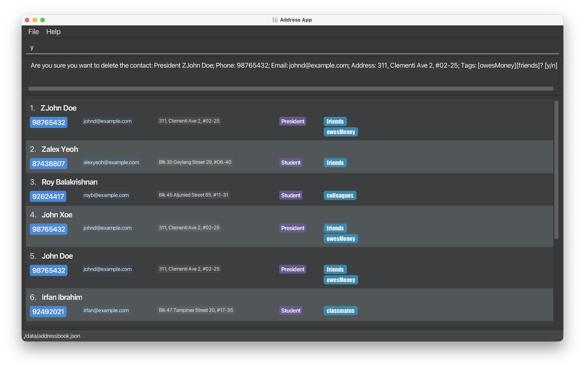
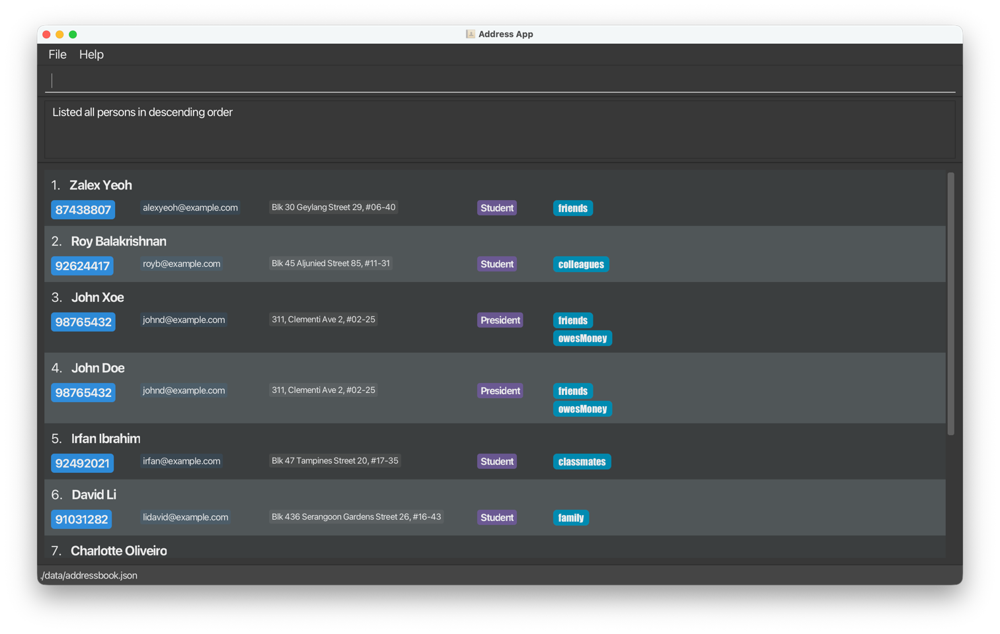

# Release Notes

## [v1.3] - 2026-03-19

### Changes to MVP - Feature 1
- **Duplicate Add Command Option:** Added a `[y/n]` user confirmation prompt to the `add` command to warn the user from adding duplicate contacts.
- **Input Format Refinement:** Updated the `add` and `edit` command input format to use hyphenated flags (e.g., -n, -p) instead of slash-based prefixes.

### Changes to MVP - Feature 2
- **Delete Command Safeguard:** Added a mandatory `[y/n]` user confirmation prompt to the `delete INDEX` command to prevent the accidental deletion of contacts.

### Additional Changes
- Introduce new interface `ConfirmCommand` that represents command types that handles confirmation from user before execution.
- Introduce new classes `ConfirmAddCommand` and `ConfirmDeleteCommand` that implement `ConfirmCommand`, and inherit from its base classes (`AddCommand`, `DeleteCommand`).
- Introduce and implement logic flow for commands that requires confirmation.

#### Product UI
Using `add -rPresident -nJohn Doe -p98765432 -ejohnd@example.com -a311, Clementi Ave 2, #02-25 -tfriends -towesMoney` 2 times consecutively will trigger a confirmation prompt:

Using `delete 1` command will trigger a confirmation prompt:

### Changes to MVP - Feature 3
- **Enhanced Find Command:** Updated the `find` command to support explicit search types using `find name ...` and `find tag ...`.
- **Multi-word Search Support:** Added support for semicolon-separated keyword groups, allowing inputs such as `find name alice pauline ; josh` and `find tag friends ; owes me ; secretary`.
- **Flexible Matching:** Search is now case-insensitive and supports partial matching for both names and tags.
- **Input Validation:** Added validation to reject invalid keyword groups containing non-alphanumeric characters.

### Changes to MVP - Feature 4
- **Useful List - Sort:** Added the (optional) ability to display contacts in sorted order (ascending or descending by name).
- **Useful List - UI:**
  - Improved the readability of the contact list by aligning key fields (name, phone, email, tags) consistently.
  - Added light visual styling such as bold text and color variations to highlight important contact information.
  - Added a click-to-copy function with user feedback.

#### Product UI
Using `list reverse` command to display contacts in reverse order:

### Improvements
- Not applicable.

### Bug Fixes
- Fixed an issue where the address book failed to load contact entries correctly when duplicate names existed.

### Documentation
- Updated the User Guide.
- Updated the Developer Guide.

---
Done by: CS2103T-W13-3

