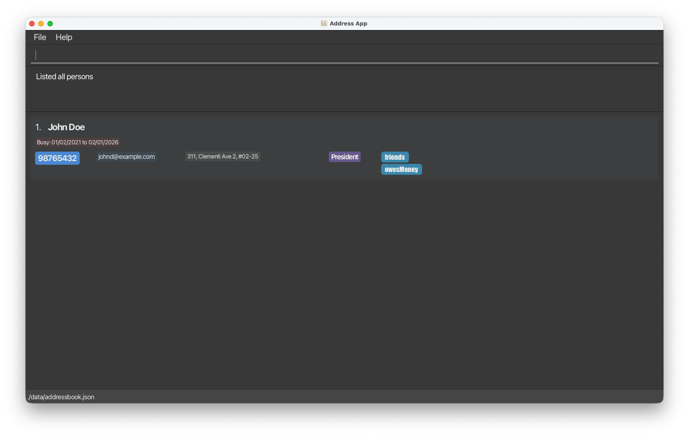

# Release Notes

## [v1.4] - 2026-03-26

#### Product UI

<!-- use this header format and name it appropriately, lets not use feature 1/2/3 -->
### Changes from MVP to Alpha Release - Addition Of `Busy` Command
- Added `busy` command to mark contacts as unavailable for specific periods.
- Implemented strict date validation for all date-related inputs.
- Enhanced the UI to display busy periods on contact cards.
- Made contact fields, including busy periods, copyable by clicking.

### Changes from MVP to Alpha Release - Optional Fields for Contacts
- Modified the `add` command so that `Role`, `Phone`, `Email`, and `Address` are completely optional fields (only `Name` remains strictly required).
- Adjusted the `PersonCard` contact user interface to dynamically collapse and hide missing fields, creating a cleaner viewing layout for concise profiles.
- Streamlined success command message formats to elegantly omit fields that were not provided.
- Persisted data safely handling missing fields through improved JSON mapping logic using `java.util.Optional`.

### Changes from MVP to Alpha Release - Addition of `BusyFilter` Command
- Introduced the `busyfilter` command, allowing users to filter contacts based on whether they are busy during a specified date range.
- Implemented overlap logic to accurately determine if a contact's busy periods intersect with the specified range.
- Updated parser and command infrastructure to support input validation and seamless integration with existing contact list filtering.

### Changes from MVP to Alpha Release - Updated clear command with confirmation
- Added a `ConfirmClearCommand` workflow so `clear` now asks for confirmation before deletion.
- Replaced the previous immediate full reset behavior with a two-step process (`clear` -> prompt -> `y`/`n`).
- Updated `clear` to delete only the currently listed/filtered contacts, then refresh the list to show remaining contacts.

### Changes from MVP to Alpha Release - Confirmation Flow for `Edit`
- Added confirmation support for the `edit` command.
- Added a warning when an edit would result in a duplicate contact.

### Improvements
- Helps users avoid scheduling meetings during contacts' peak busy periods.

### Bug Fixes
- NA

### Documentation
- Updated the User Guide.
- Updated the Developer Guide.

---
Done by: CS2103T-W13-3
