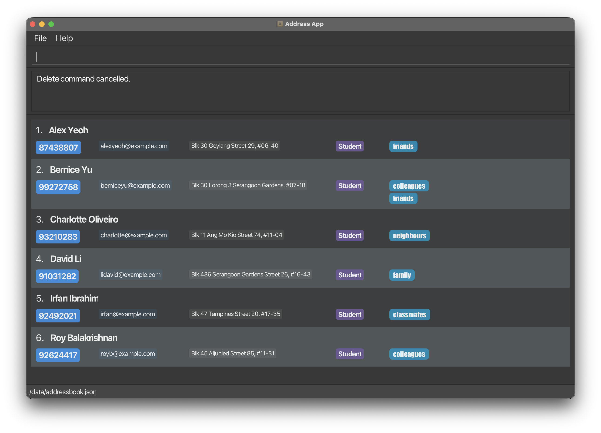

# Release Notes

## [v1.5] - 2026-04-02

#### Product UI (To be updated)

<!-- use this header format and name it appropriately, lets not use feature 1/2/3 -->
### Improvements
- Feature `busy`: Users can now add multiple busy periods to a contact. Overlapping periods are automatically merged.
- Feature `add`: Phone numbers now allow spaces between digits. Entered phone numbers are normalized by removing whitespace before storage.
- Feature `busyfilter`: Improved invalid command message.
- Feature `help`: Directly opens the user guide on the user's default browser.
- Feature `list`: Update the error message examples displayed.
- Improvement to command confirmation: If the user cancels a command with "`n`" when prompted for confirmation, a message reflecting that the corresponding command was cancelled will now be displayed.

- Feature `clear`: Command success message includes number of contacts getting cleared.
- Feature `edit`: Confirmation message now shows a detailed field-by-field summary of the changes to be made.
- Feature `edit`: Edits that do not make any effective change are now rejected.
- Product UI: Result display area has been adjusted to better accommodate longer multi-line confirmation messages.
- Feature `exit`: Command requires `[y/n]` confirmation before exit the application

### Bug Fixes
- Feature `add`: Hide tags when there are none.
- Feature `list`/`busyfilter`/`find`: Displaying 0 people and 1 person will now have a clearer display message.

### Documentation
- Updated the User Guide.
- Updated the Developer Guide.

---
Done by: CS2103T-W13-3
