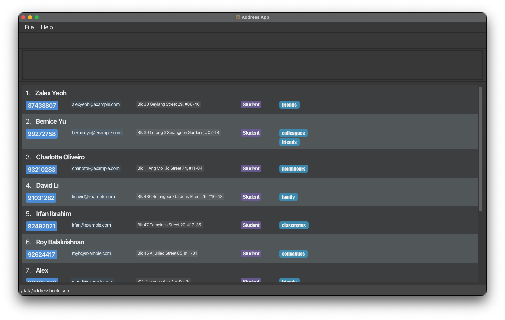
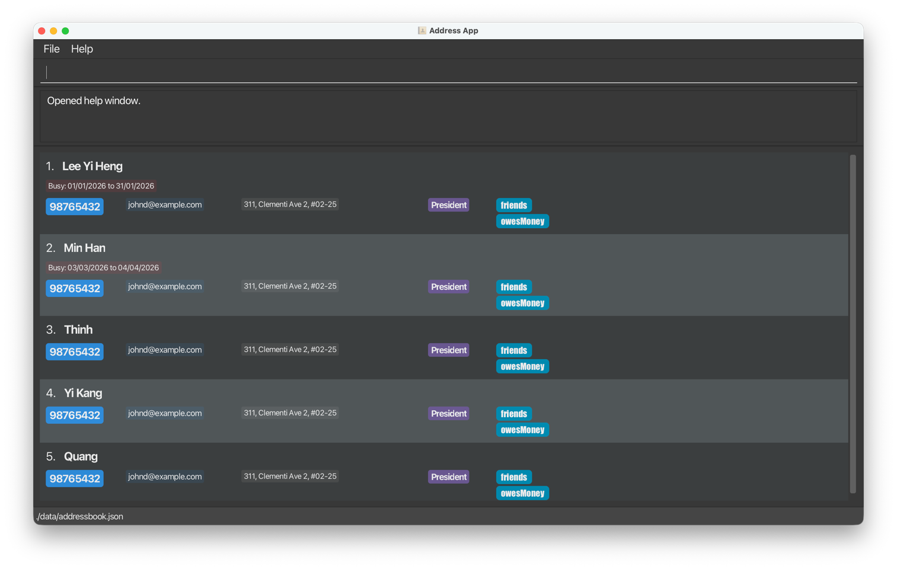
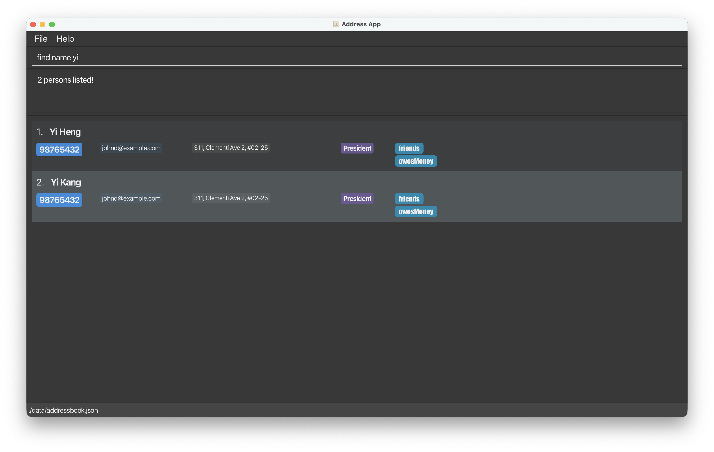

CampusConnect is a **desktop contact management application designed for student leaders who need to coordinate across multiple university committees**. It is optimized for use via a Command Line Interface (CLI), while still providing the benefits of a Graphical User Interface (GUI).

CampusConnect is especially suited for a **NUSSU secretary or student leader managing many contacts across different committees**, who needs quick access to contact details and availability. The app allows users to efficiently store, search, and organise contacts, as well as track when individuals are busy due to meetings or events.

By enabling fast command-based interactions, CampusConnect helps users **quickly retrieve information and identify scheduling conflicts**, reducing the time spent navigating scattered contact lists and improving coordination across student leadership bodies.

## **Table of Contents**

- [Quick start](#quick-start)
- [Features](#features)
    - [Viewing help: `help`](#viewing-help--help)
    - [Adding a person: `add`](#adding-a-person-add)
    - [Listing all persons: `list`](#listing-all-persons--list)
        - [1. Default Listing](#1-default-listing)
        - [2. Sorted Listing](#2-sorted-listing)
        - [3. Bonus: Copying of fields in a list](#3-bonus-copying-of-fields-in-a-list)
    - [Marking a person as busy : `busy`](#marking-a-person-as-busy--busy)
    - [Locating persons by busy period: `busyfilter`](#locating-persons-by-busy-period-busyfilter)
    - [Editing a person : `edit`](#editing-a-person--edit)
    - [Locating persons by name/tags: `find`](#locating-persons-by-nametags-find)
    - [Deleting a person : `delete`](#deleting-a-person--delete)
    - [Clearing listed/filtered entries : `clear`](#clearing-listedfiltered-entries--clear)
    - [Exiting the program : `exit`](#exiting-the-program--exit)
    - [Saving the data](#saving-the-data)
    - [Editing the data file](#editing-the-data-file)
    - [Archiving data files `[coming in v2.0]`](#archiving-data-files-coming-in-v20)
- [FAQ](#faq)
- [Known issues](#known-issues)
- [Command summary](#command-summary)

--------------------------------------------------------------------------------------------------------------------

## Quick start

1. Ensure you have Java `17` or above installed in your Computer.<br>
   **Mac users:** Ensure you have the precise JDK version prescribed [here](https://se-education.org/guides/tutorials/javaInstallationMac.html).

1. Download the latest `.jar` file from [here](https://github.com/se-edu/addressbook-level3/releases).

1. Copy the file to the folder you want to use as the _home folder_ for your AddressBook.

1. Open a command terminal, `cd` into the folder you put the jar file in, and use the `java -jar addressbook.jar` command to run the application.<br>
   A GUI similar to the below should appear in a few seconds. Note how the app contains some sample data.<br>
   

1. Type the command in the command box and press Enter to execute it. e.g. typing **`help`** and pressing Enter will open the help window.<br>
   Some example commands you can try:

  * `list` : Lists all contacts.

  * `add -r President -n John Doe -p 98765432 -e johnd@example.com -a John street, block 123, #01-01` : Adds a contact named `John Doe` to the Address Book.

  * `find name Alice ; Benson` : Find contacts with name including Alice or Benson.

  * `add n/John Doe p/98765432 e/johnd@example.com a/John street, block 123, #01-01` : Adds a contact named `John Doe` to the Address Book.

  * `delete 3` : Deletes the 3rd contact shown in the current list.

  * `clear` : Deletes listed/filtered contacts.

  * `exit` : Exits the app.

1. Refer to the [Features](#features) below for details of each command.

--------------------------------------------------------------------------------------------------------------------

## Features

<div markdown="block" class="alert alert-info">

**:information_source: Notes about the command format:**<br>

* Words in `UPPER_CASE` are the parameters to be supplied by the user.<br>
  e.g. in `add -n NAME`, `NAME` is a parameter which can be used as `add -n John Doe`.

* Items in square brackets are optional.<br>
  e.g `-n NAME [-t TAG]` can be used as `-n John Doe -t friend` or as `-n John Doe`.

* Items with `…`​ after them can be used multiple times including zero times.<br>
  e.g. `[-t TAG]…​` can be used as ` ` (i.e. 0 times), `-t friend`, `-t friend -t family` etc.

* Parameters can be in any order.<br>
  e.g. if the command specifies `-n NAME -p PHONE_NUMBER`, `-p PHONE_NUMBER -n NAME` is also acceptable.

* Extraneous parameters for commands that do not take in parameters (such as `help`, `list`, `exit` and `clear`) will be ignored.<br>
  e.g. if the command specifies `help 123`, it will be interpreted as `help`.

* If you are using a PDF version of this document, be careful when copying and pasting commands that span multiple lines as space characters surrounding line-breaks may be omitted when copied over to the application.
</div>

### Viewing help : `help`

Shows a message explaining how to access the help page.



Format: `help`

### Adding a person: `add`

Adds a person to the address book.

Format: `add -r ROLE -n NAME -p PHONE_NUMBER -e EMAIL -a ADDRESS [-t TAG]…​`

<div markdown="span" class="alert alert-primary">:bulb: **Tip:**
A person can have any number of tags (including 0)
</div>

If the person being added does **not** already exist in the address book, the contact will be added immediately.

If the person being added **already exists**, the application will prompt for confirmation before proceeding.

**Duplicate-add confirmation prompt:**
> `This person already exists: XXX`
> `Add anyway? [y/n]`

* If `y` is entered, the duplicate contact will be added.
* If `n` is entered, the add operation will be cancelled.

Examples:
* `add -r President -n John Doe -p 98765432 -e johnd@example.com -a John street, block 123, #01-01`
* `add -r Logistics -n Betsy Crowe -t friend -e betsycrowe@example.com -a Newgate Prison -p 1234567 -t criminal`

### Listing all persons : `list`

Shows a list of all persons in the address book.

#### 1. Default Listing

Displays all contacts in the order they are stored.

**Format:**
`
list
`

**Example:**
```
list
```

**Expected Result:**
All contacts are displayed in their default order.

#### 2. Sorted Listing

You can sort contacts alphabetically in ascending or descending order.

**Format:**
`list SORT_ORDER`

**Ascending (A → Z):**
```
list sort
list ascending
```

**Expected Result:**
All contacts are displayed in ascending alphabetical order by name.

**Descending (Z → A):**

```
list descending
list reverse
```

**Expected Result:**
All contacts are displayed in descending alphabetical order by name.

#### 3. Bonus: Copying of fields in a list

You can copy the value of a field (e.g. phone number) of a contact in the list to the clipboard by clicking on the field!

**Expected Result:**
The field turns pink for a temporary period to indicate that it has been copied, and you can paste the value elsewhere.

### Marking a person as busy : `busy`

Marks a contact as busy for a specific period.

Format: `busy INDEX -s START_DATE -e END_DATE`

<div markdown="span" class="alert alert-warning">:exclamation: **Caution:**
Running `busy` again for the same contact replaces the previous busy period instead of merging date ranges.
</div>

* Marks the person at the specified `INDEX` as busy from `START_DATE` to `END_DATE`.
* The index refers to the index number shown in the displayed person list. The index **must be a positive integer** 1, 2, 3, …​
* Dates **must follow the DD/MM/YYYY format** (e.g., 25/03/2026).
* The `START_DATE` must be chronologically before or equal to the `END_DATE`.
* If the contact already has a busy period, running a valid `busy` command will overwrite the existing period.
* The busy period will be displayed in the contact's card in the UI.

Examples:
* `list` followed by `busy 1 -s 25/03/2026 -e 28/03/2026` marks the 1st person in the list as busy from March 25 to March 28, 2026.
* `find name Betsy` followed by `busy 1 -s 01/04/2026 -e 05/04/2026` marks the 1st person in the results as busy.

### Locating persons by busy period: `busyfilter`

Filters and displays contacts who are busy during a specified date range.

A contact is considered busy if there exists at least one day within the given period such that the contact is busy on that day.

Otherwise, the contact is considered not busy if for all days in the specified period, the contact is not busy.

#### Basic Usage

Shows all contacts who are busy at **any point within the given date range**.

**Format:**
`
busyfilter -s START_DATE -e END_DATE
`

* `START_DATE` and `END_DATE` must be in `DD/MM/YYYY` format.
* Contacts with busy period are considered available and will not be displayed.

**Example:**
```
busyfilter -s 01/01/2026 -e 31/01/2026
```

**Expected Result:**
All contacts who have are busy on any day from 1 Jan 2026 to 31 Jan 2026 are listed.

### Editing a person : `edit`

Edits an existing person in the address book.

Format: `edit INDEX [-r ROLE] [-n NAME] [-p PHONE_NUMBER] [-e EMAIL] [-a ADDRESS] [-t TAG]…​`

* Edits the person at the specified `INDEX`. The index refers to the index number shown in the displayed person list. The index **must be a positive integer** 1, 2, 3, …​
* At least one of the optional fields must be provided.
* Existing values will be updated to the input values.
* When editing tags, the existing tags of the person will be removed i.e adding of tags is not cumulative.
* You can remove all the person’s tags by typing `-t` without
  specifying any tags after it.

Before the edit is performed, the application will prompt for confirmation.

> `Are you sure you want to edit the contact: YYY? [y/n]`

If the edited person duplicates an existing person, the application will also show a warning before prompting for confirmation.

**Duplicate-edit confirmation prompt:**
> `Warning: XXX`<br>
> `is an existing person.`<br>
> `Are you sure you want to edit the contact: YYY? [y/n]`

* If `y` is entered, the edit will proceed.
* If `n` is entered, the edit will be cancelled.

Examples:
*  `edit 1 -p 91234567 -e johndoe@example.com` Edits the phone number and email address of the 1st person to be `91234567` and `johndoe@example.com` respectively.
*  `edit 2 -n Betsy Crower -t` Edits the name of the 2nd person to be `Betsy Crower` and clears all existing tags.

### Locating persons by name/tags: `find`

Finds persons whose names/tags contain any of the given keywords.

Format: `find SEARCH_BY KEYWORD [; MORE_KEYWORDS]...`

<div markdown="span" class="alert alert-primary">:bulb: **Tip:**
Use `;` to split phrases into multiple search groups, e.g. `find name alice pauline ; josh`.
</div>

* `SEARCH_BY` must be either `name` or `tag` (lowercase).
* The search is case-insensitive. e.g. `alice` will match `Alice`.
* Use `;` to separate multiple keywords. Each keyword can contain spaces.
* Persons matching at least one keyword will be returned (`OR` search).
* Matching is based on text containment. e.g. `ali` will match `Alice`.
* Keywords can only contain alphanumeric characters and spaces.

Examples:
* `find name alice pauline ; josh` returns persons whose names contain `alice pauline` or `josh`.
* `find tag friends ; owes me ; secretary` returns persons with tags containing `friends`, `owes me`, or `secretary`.
* `find name alex ; david` returns `Alex Yeoh`, `David Li`.<br>
  

### Deleting a person : `delete`

Deletes the specified person from the address book.

Format: `delete INDEX`

<div markdown="span" class="alert alert-warning">:exclamation: **Caution:**
`INDEX` refers to the currently displayed list. Run `list` first if you want to delete from the full contact list.
</div>

* Deletes the person at the specified `INDEX`.
* The index refers to the index number shown in the displayed person list.
* The index **must be a positive integer** 1, 2, 3, …​
* Before deletion is performed, the application will prompt for confirmation.

**Delete confirmation prompt:**
> `Are you sure you want to delete the contact: XXX? [y/n]`

* If `y` is entered, the person will be deleted.
* If `n` is entered, the delete operation will be cancelled.

Examples:
* `list` followed by `delete 2` prompts confirmation for deleting the 2nd person in the address book.
* `find name Betsy` followed by `delete 1` prompts confirmation for deleting the 1st person in the results of the `find` command.

### Clearing listed/filtered entries : `clear`

Clears the contacts currently shown in the list.

Format: `clear`

<div markdown="span" class="alert alert-warning">:exclamation: **Caution:**
`clear` affects all contacts currently shown in the list. If the list is filtered, only the filtered contacts are targeted.
</div>

* The command targets only the currently listed/filtered contacts.
* A confirmation prompt is shown before contacts are removed.

**Clear confirmation prompt:**
> `Are you sure you want to clear the currently listed contacts? [y/n]`

* If `y` is entered, the listed/filtered contacts are deleted.
* If `n` is entered, the operation is cancelled.

Examples:
* `list` followed by `clear` then `y` clears all currently listed contacts.
* `find tag friends` followed by `clear` then `y` clears only the filtered contacts in that result.
* `clear` followed by `n` cancels the operation and leaves all contacts unchanged.

### Exiting the program : `exit`

Exits the program.

Format: `exit`

### Saving the data

AddressBook data are saved in the hard disk automatically after any command that changes the data. There is no need to save manually.

### Editing the data file

AddressBook data are saved automatically as a JSON file `[JAR file location]/data/addressbook.json`. Advanced users are welcome to update data directly by editing that data file.

<div markdown="span" class="alert alert-warning">:exclamation: **Caution:**
If your changes to the data file makes its format invalid, AddressBook will discard all data and start with an empty data file at the next run. Hence, it is recommended to take a backup of the file before editing it.<br>
Furthermore, certain edits can cause the AddressBook to behave in unexpected ways (e.g., if a value entered is outside of the acceptable range). Therefore, edit the data file only if you are confident that you can update it correctly.
</div>

### Archiving data files `[coming in v2.0]`

_Details coming soon ..._

--------------------------------------------------------------------------------------------------------------------

## FAQ

**Q**: How do I transfer my data to another Computer?<br>
**A**: Install the app in the other computer and overwrite the empty data file it creates with the file that contains the data of your previous AddressBook home folder.

--------------------------------------------------------------------------------------------------------------------

## Known issues

1. **When using multiple screens**, if you move the application to a secondary screen, and later switch to using only the primary screen, the GUI will open off-screen. The remedy is to delete the `preferences.json` file created by the application before running the application again.
2. **If you minimize the Help Window** and then run the `help` command (or use the `Help` menu, or the keyboard shortcut `F1`) again, the original Help Window will remain minimized, and no new Help Window will appear. The remedy is to manually restore the minimized Help Window.

--------------------------------------------------------------------------------------------------------------------

## Command summary

Action | Format, Examples
--------|------------------
**Add** | `add -r ROLE -n NAME -p PHONE_NUMBER -e EMAIL -a ADDRESS [-t TAG]…​` <br> e.g., `add -r President -n James Ho -p 22224444 -e jamesho@example.com -a 123, Clementi Rd, 1234665 -t friend -t colleague`
**Clear** | `clear` (then confirm with `y` or cancel with `n`)
**Busy** | `busy INDEX -s START_DATE -e END_DATE`<br> e.g., `busy 1 -s 25/03/2026 -e 28/03/2026`
**BusyFilter** | `busyfilter -s START_DATE -e END_DATE`<br> e.g., `busyfilter -s 01/01/2026 -e 31/01/2026`
**Delete** | `delete INDEX`<br> e.g., `delete 3`
**Edit** | `edit INDEX [-r ROLE] [-n NAME] [-p PHONE_NUMBER] [-e EMAIL] [-a ADDRESS] [-t TAG]…​`<br> e.g.,`edit 2 -n James Lee -e jameslee@example.com`
**Find** | `find SEARCH_BY KEYWORD [; MORE_KEYWORDS]...`<br> e.g., `find name alex ; david`
**List** | `list [SORT_ORDER]`<br> e.g., `list reverse`
**Help** | `help`
**Exit** | `exit`

